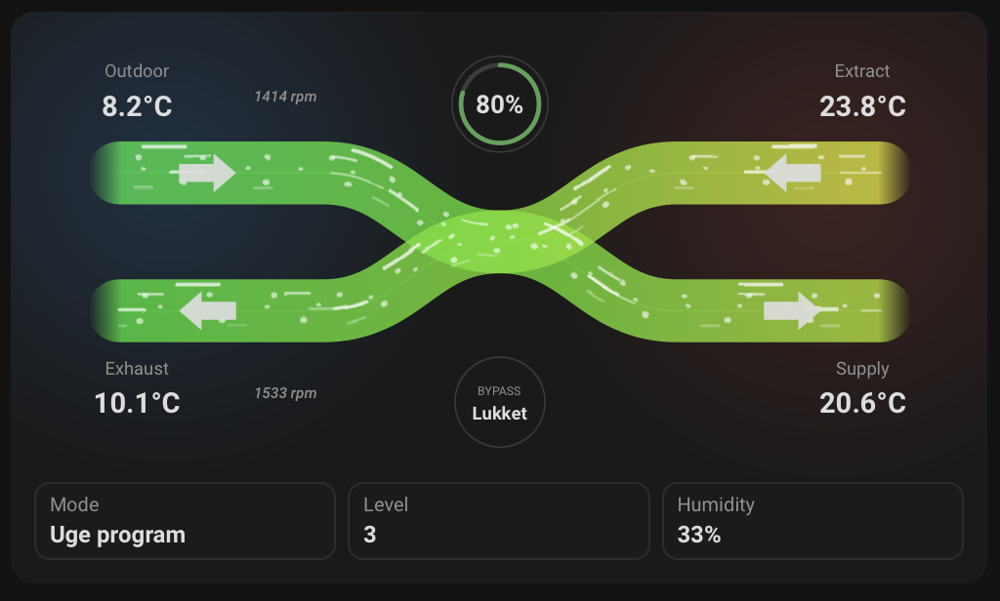

# HRV Card

Animated Home Assistant Lovelace card for heat recovery ventilation systems.

The card is intentionally vendor-neutral. You choose the entities you have, regardless of whether the system is Dantherm, Zehnder/ComfoAir, Nilan, Genvex, Brink, or another HRV/ERV unit.

The Dantherm defaults and writable mode/fan-level controls are developed based on the Home Assistant integration from [Tvalley71/dantherm](https://github.com/Tvalley71/dantherm).




Related search terms: Home Assistant ventilation card, Lovelace HRV card, heat recovery ventilation, ERV card, airflow dashboard, fan speed card, bypass ventilation, Dantherm, Nilan, Genvex, Zehnder ComfoAir, Brink.

## Features

- Animated airflow diagram
- Temperature-based airflow gradients
- Optional heat recovery and fan RPM display
- Optional mode, bypass, humidity, and fan state badges
- Works with partial configs: missing entities show as `—`
- HACS-ready repository layout
- No runtime dependencies in `ha-hrv-card.js`

## Installation

### HACS custom repository

1. In Home Assistant, go to **HACS → three dots menu → Custom repositories**.
2. Add URL https://github.com/Ralleberg/ha-hrv-card.
3. Select category **Dashboard**.
4. Download the card and refresh the browser.

### Manual installation

1. Copy `ha-hrv-card.js` to:

   ```text
   /config/www/community/ha-hrv-card/ha-hrv-card.js
   ```

2. Add a dashboard resource:

   ```yaml
   url: /local/community/ha-hrv-card/ha-hrv-card.js
   type: module
   ```

3. Refresh the browser.

## Example configuration

```yaml
 type: custom:hrv-card
 entities:
   outdoor_temperature: sensor.dantherm_outdoor_temperature
   supply_temperature: sensor.dantherm_supply_temperature
   extract_temperature: sensor.dantherm_extract_temperature
   exhaust_temperature: sensor.dantherm_exhaust_temperature
   heat_recovery: sensor.dantherm_heat_recovery_efficiency
   humidity: sensor.dantherm_humidity
   bypass: cover.dantherm_bypass_damper
   mode: select.dantherm_operation_selection
   level: select.dantherm_fan_level_selection
   fan1_rpm: sensor.dantherm_fan2_speed
   fan2_rpm: sensor.dantherm_fan1_speed
   # Optional Nilan/Genvex examples:
   # co2: sensor.remote_lscontrol_co2_sensor
   # filter_days: sensor.dantherm_filterrestlevetid
   # alarm: sensor.remote_lscontrol_active_alarms
 appearance:
   animation: true
   show_labels: true
   show_badges: true
   show_temperatures: true
   compact: false
```

## Heat Recovery Efficiency Template Sensor

The `heat_recovery` entity should be a percentage sensor. A common way to calculate heat recovery efficiency is:

```text
((supply_temperature - outdoor_temperature) / (extract_temperature - outdoor_temperature)) * 100
```

This compares how much the supply air has been warmed up relative to the available temperature difference between extract air and outdoor air. The template below clamps the result between `0` and `100`, rounds it to one decimal, and returns `NONE` when the calculation cannot be made.

Example Home Assistant template sensor:

```yaml
template:
  - sensor:
      - name: Dantherm heat recovery efficiency
        unique_id: dantherm_heat_recovery_efficiency
        unit_of_measurement: "%"
        state: >
          
          
          
          
          
            0
          
            
            {{ [0, [efficiency, 100] | min] | max | round(1) }}
          
            {{ none }}
          
```

## Configuration

### Main options

| Option | Type | Required | Description |
| --- | --- | --- | --- |
| `type` | string | yes | Must be `custom:hrv-card` |
| `entities` | object | no | Entity mapping |
| `appearance` | object | no | Visual options |

### Entities

| Key | Description |
| --- | --- |
| `outdoor_temperature` | Outdoor/fresh air temperature before HRV |
| `supply_temperature` | Supply air temperature after HRV |
| `extract_temperature` | Extract air temperature from rooms |
| `exhaust_temperature` | Exhaust air temperature after HRV |
| `heat_recovery` | Heat recovery efficiency in percent, shown as a compact flow indicator when bypass is closed and mode is not summer |
| `humidity` | Humidity sensor |
| `bypass` | Bypass state/text sensor or cover. Open/åben/on/255 switches the diagram to direct non-crossing airflow |
| `mode` | Operation mode sensor or select. Select entities are shown as clickable value badges that open the Home Assistant entity dialog. Summer/sommer switches the diagram to one-way extract-to-exhaust airflow |
| `level` | Ventilation level sensor or select. Select entities are shown as clickable value badges that open the Home Assistant entity dialog. Values 1-4 control airflow animation speed |
| `co2` | Optional CO2 sensor shown as a small status circle left of bypass |
| `filter_days` | Optional remaining filter days sensor shown as a small status circle right of bypass. When the value is `0` or lower, the value turns red and fades/blinks |
| `alarm` | Optional alarm entity. `No Alarm`, `No alarm`, `Ingen`, `0`, `none`, `ok`, `clear`, or `off` are treated as no alarm; other text or numbers above `0` show a red blinking warning triangle |
| `fan1_rpm` | Fan RPM/speed sensor shown as small italic text beside the upper flow. Dantherm defaults map this to fan 2 speed |
| `fan2_rpm` | Fan RPM/speed sensor shown as small italic text beside the lower flow. Dantherm defaults map this to fan 1 speed |

### Appearance

| Key | Default | Description |
| --- | --- | --- |
| `animation` | `true` | Enable animated airflow |
| `show_labels` | `true` | Show Outdoor/Supply/Extract/Exhaust labels |
| `show_badges` | `true` | Show optional state badges |
| `show_temperatures` | `true` | Show temperature values in the diagram |
| `compact` | `false` | Slightly smaller padding/card size |

## Development

```bash
npm install
npm run dev
```

For production build:

```bash
npm run build
```

The distributable file is written to:

```text
ha-hrv-card.js
```

## Roadmap

- Better visual editor using Home Assistant entity pickers
- More layout variants
- Optional airflow direction labels
- Optional internal heat recovery calculation if all temperature entities are available
- Theming with CSS variables
- Translations

## Credits

Inspired by older ventilation Lovelace cards such as `lovelace-comfoair`, but implemented as a new vendor-neutral HRV card.
